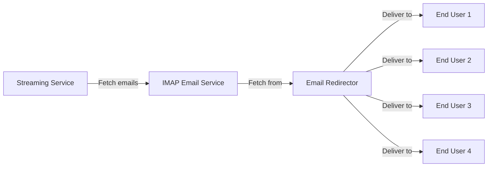

### 📨 Email Redirector

This is a dynamic solution for the automated management of emails, enabling the reading, filtering, and redirection of emails through IMAP and SMTP servers. It adheres to SPF and DKIM standards, thus preventing issues related to these security policies.




#### ⚙️ Configuration

The `emailRedirectorConfig.yaml` file needs to be precisely configured to set up connection parameters and email processing rules:

```yaml
imap:
  host: imap.host.com
  port: 993
  ssl: true
  user: user@example.com
  pass: "password"
  mailbox: Inbox

smtp:
  host: smtp.host.com
  port: 465
  ssl: true
  user: user@example.com
  pass: "password"

filters:
  - name: ServiceName
    conditions:
      - field: From
        value: 'email@service.com'
      ...
accountMapping:
  user1@example.com:
    - userx@example.com
    - usery@example.com
  ...
```

#### 🚀 Key Features

- **🔐 Secure Connections**: Establishes secure SSL connections with IMAP and SMTP servers.
- **📑 Intelligent Filtering and Redirection**: Applies filters without altering critical header fields, avoiding blocks related to SPF and DKIM policies.
- **🔄 Customizable Actions**: Modifies `From`, `To`, and adds `Bcc` fields according to defined rules for effective management.
- **🗺️ Flexible Account Mapping**: Facilitates complex redirection scenarios through a customized account mapping system.

#### 🧑‍💻 Code Details

The Python script incorporates several essential modules for email processing:

1. **📁 Configuration Loading**: Extracts parameters from the YAML file.
2. **📬 IMAP Email Reading**: Connects and retrieves emails based on specific criteria.
3. **🔍 Applying Filters and Redirection**: Modifies and redirects emails according to established rules.
4. **📧 SMTP Sending**: Transmits modified emails while complying with anti-spam standards.
5. **🛠️ Exception Management and Logging**: Captures and logs errors for facilitated troubleshooting.

#### 🚀 Usage

To get started with this system:

**Configure** the YAML file to meet your email environment requirements.
**Run** the script using the command:
   ```bash
   python3 email_redirector.py
   ```

#### 🔒 Security and Compliance

The design complies with email security policies, enabling hassle-free and secure redirection, avoiding rejections due to strict controls like SPF and DKIM.

## Contributing

Contributions to this project are welcome. If you encounter any issues, have suggestions, or want to add features, please open an issue or create a pull request. Your contributions will help improve this automation tool.
